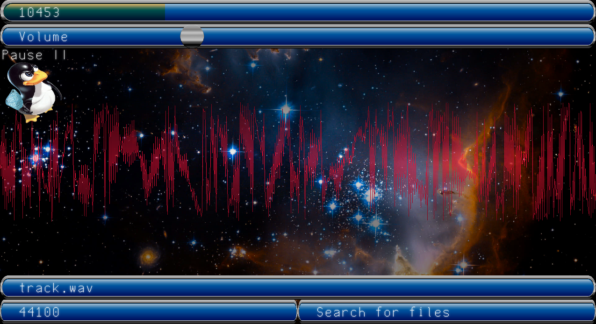

# Kysela

Kysela is a low-level linux audio player made for customizability. You can arrange graphical buttons with custom dimensions, textures, and more to create a look/feel specific to your needs. Within the program you can play files as audio, search for loaded files by sub string, change the volume, change the sample rate, pause/play, rewind/fast forward/change position of song, etc.

<h2>How to compile</h2>

Simply do "sudo make all" to compile the program into an executable named "kysela".

<h2>How to add files to player</h2>

To add files to the player just simply copy the directory path to the file anywhere in the config file. You can also add entire directories, which will add everything regardless if it is a .wav file or not (even the unix "." and ".." lol).

Currently there isn't much in support for file organization or graphical front ends for editing configs, these will be added in future updates.

<h2>How to edit and load config files</h2>

If no argument is given during execution, Kysela will try to load a "kysela.config" file in the current working directory, to load other config files simply pass the path of the file to the "./kysela" executable. 

Aside from adding files to play, you can also comment things out with the "#" character and use special keywords for settings. Currently there are 4 settings available for user customization, those being "$MAIN", "$BUTTON", "$WAVE", "$IMAGE". Each of these settings take certain arguments with each being seperated by a ";" character. These arguments can be anything from integers, strings, files, bool values etc. Images passed as arguments must be saved as bitmaps (.bmp files), since that is what SDL uses to load image. String (and file path) arguments can be replaced with the argument "null" when appropriate. The config file parser is not very complicated so each setting must be formatted specifically this way. That format being "$SETTING;arg1;arg2;arg3;arg4;(...)" where each setting ends in a newline.

<h3>Settings: $MAIN</h3>

The "$MAIN" setting dictates general things about the program, it has 5 arguments.

<ol>
  <li>Width of window on launch</li>
  <li>Height of window on launch</li>
  <li>Path to default background image</li>
  <li>Path to font bitmap image</li>
  <li>Delay in ms for SDL drawing loop</li>
</ol>

<h3>Settings: $BUTTON</h3>

The "$BUTTON" setting creates a graphical widget with certain characteristics for drawing, function, resizing etc. It is by far the most complicated and takes 24 arguments, so this section will contain more detail than others. If less than 24 arguments are given, the button will not be created. 

<ol>
  <li>Integer value dictating the function of the button. 0 is the file selector, 1 is the pause button, 2 is the song position, 3 is the volume, 4 is for searching for files, 5 is for setting the sample rate. A value of 255 is reserved for non functional buttons that exist just to draw custom images to the screen.</li>
  <li>Integer value dictating the slider type of the button. 0 is no slide, 1 is a horizontal slide, 2 is a vertical slide, 3 and 4 are special values relating to the 11th argument for secondary images.</li>
  <li>Integer value for the x position of the button.</li>
  <li>Integer value for the y position of the button.</li>
  <li>Integer value for the width of the button.</li>
  <li>Integer value for the height of the button.</li>
  <li>Integer value for the 24 bit color of the button.</li>
  <li>Integer value for the 24 bit secondary color of the button.</li>
  <li>Percent value for a black to transparent gradient. (This one is kinda phoned in might change it later.)</li>
  <li>File path to the texture image. If "null", button will be rectangle drawn with the color given earlier.</li>
  <li>File path to the secondary texture image. This image is only used for slides, if "null" slides will not use a texture. If there is a slide value of 1 or 2, the image will be cropped until slider is set to 100%. If there is a slide value of 3 or 4, the image will be drawn in full and centered at the position of the slide.</li>
  <li>Boolean value (1 or 0) for width stretching. If set, button's width will extend until the edge of the screen.</li>
  <li>Boolean value (1 or 0) for height stretching. If set, button's height will extend until the edge of the screen.</li>
  <li>Boolean value (1 or 0) for x offset. If set, button will be drawn x pixels from right of screen. The x value is the original value passed in argument 3.</li>
  <li>Boolean value (1 or 0) for y offset. If set, button will be drawn y pixels from bottom of screen. The y value is the original value passed in argument 4.</li>
  <li>Boolean value (1 or 0) for width offset. If set, the width of the button will extend to w pixels away from the edge of the screen. The w value is the original value passed in argument 5.</li>
  <li>Boolean value (1 or 0) for height offset. If set, the height of the button will extend to h pixels away from the edge of the screen. The h value is the original value passed in argument 6.</li>

  <li>Percent value for x spacing. The x value of the button will be the current width of the window multiplied by the given percent as a decimal. Argument 14 must be 1. (50 = 0.5, 33 = 0.33 etc.)</li>
  <li>Percent value for y spacing. The y value of the button will be the current height of the window multiplied by the given percent as a decimal. Argument 15 must be 1. (50 = 0.5, 33 = 0.33 etc.)</li>
  <li>Percent value for width spacing. The width of the button will be the current width of the window multiplied by the given percent as a decimal. Argument 12 must be 1. (50 = 0.5, 33 = 0.33 etc.)</li>
  <li>Percent value for height spacing. The height of the button will be the current height of the window multiplied by the given percent as a decimal. Argument 13 must be 1. (50 = 0.5, 33 = 0.33 etc.)</li>
  <li>String for text. Will print given string on button. If "null", no text will be printed.</li>
  <li>Integer value for x value of text. Will draw text at current x value of button + given value.</li>
  <li>Integer value for y value of text. Will draw text at current y value of button + given value.</li>
</ol>

<h3>Settings: $WAVE</h3>

The wave drawn to the center of the screen uses the raw audio data from the file that gets sent to the soundcard. The "$WAVE" setting determines the settings for the audio wave drawn to the screen, it has 7 arguments.

<ol>
  <li>R byte value of 24 bit color of wave.</li>
  <li>G byte value of 24 bit color of wave.</li>
  <li>B byte value of 24 bit color of wave.</li>
  <li>Boolean flag that determines if the wave is drawn vertically or horizontally. 0 is horizontal, 1 is vertical.</li>
  <li>Boolean flag for drawing shadow to the screen that is weaker as it gets to the center of the wave. I added this because it just looks nice.</li>
  <li>Amplitude multiplier of wave. 0 mean no wave will be drawn at all, 1 is normal sized, anything larger than 1 is currently broken (doesn't draw the shadow correctly), sorry.</li>
  <li>How many soundbuffer bytes are skipped when the wave is drawn. 1 is every byte drawn, 2 is every 2nd byte drawn, 3 is every 3rd byte drawn etc.</li>
</ol>

<h3>Settings: $IMAGE</h3>

The "$IMAGE" setting adds images to be loaded as the background when the current file being played contains a given substring in its name. It takes 2 arguments.

<ol>
  <li>File path to the image to be loaded.</li>
  <li>Substring used to tell Kysela when to swap the background image.</li>
</ol>
